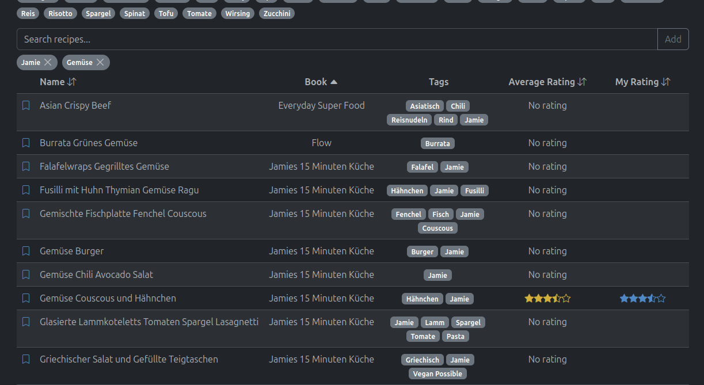
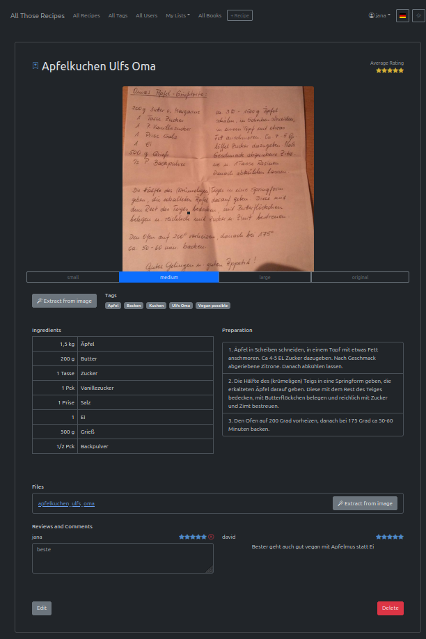
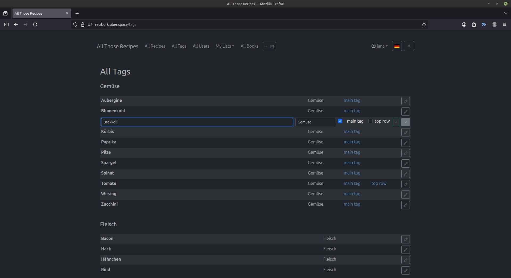
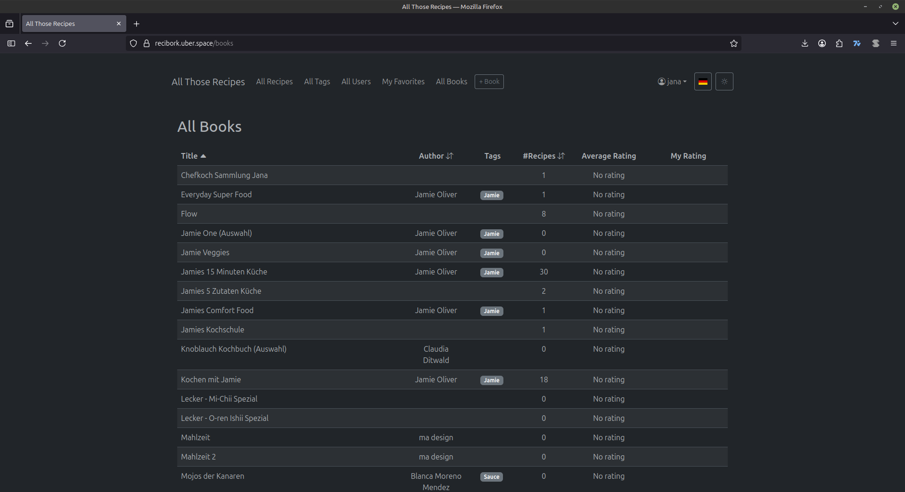
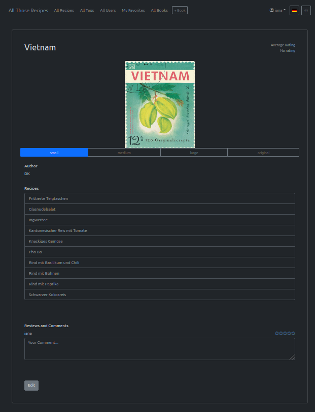

# all-those-recipes
just another recipe management app for everyone collecting too many of them.

## All Recipes
View all your recipes with their tags and ratings, sort them, and quickly add or remove favorites

Filter for tags or enter search queries

## Shopping Lists
Chose recipes and generate a combined shopping list from the ingredients

Get a pdf

Re-access shopping lists and add comments

## Cooking Overview
Chose reicpes and generate a cooking overview from the steps

Strike steps already done and add notes where needed

Generate a print version if needed

## Recipe Details
See and edit all parts of a recipe

Fill ingredients and steps from the thumbnail or files with one button click

## All Tags
Manage available tags, group them, and decide which should be clickable where in the recipe search

## All Users
Manage users for your recipe app

Users can change their password themselves

## My Favorites
Manage your personal favorites, comments and ratings. Sort them as you like

## All Books
Add books to collect recipes in them

## Book Details
See and edit all parts of a book
